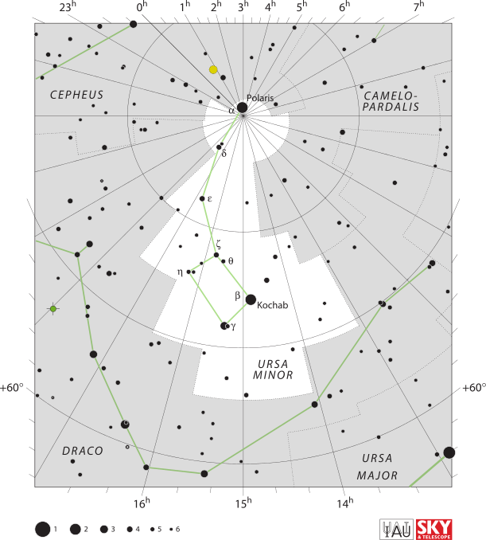

# Vue.js feladatok

Töltsd le vagy forkold a repository-t és készítsd el az alábbi menő appokat Vue.js segítségével! :)
A három feladatot a három "üres" mappába el is tudod helyezni.

## 0. sort it!
  - Harry Potter sorting hat (teszlek süveg) - házválasztó app
  - api hívás gombnyomásra: https://www.potterapi.com/v1/sortingHat ([docs](https://www.potterapi.com/))
  - válasz megmutatása
  - legyen szép! :)

  
## 1. show it!
  - csillagkép kiválasztása listából
  - az adatok innen jönnek: [/data/constellations.json](data/constellations.json) (az abbreviation mező értékét kell az alábbi cím limit paraméterének átadni)
  - api hívás -> http://www.astropical.space/astrodb/api.php?table=stars&which=constellation&limit=umi&format=csv ([docs](http://www.astropical.space/astrodb/apiref.php))
  - jelenjenek meg egy canvas-on
  - részletek megjelenítése
  - legyen szép! :)
  - jelenítsük meg a wikipedia képét is (térkép) (optional)
  - api hívás -> olvassa fel a nevét (optional)
  - mutasson a wikipedia oldalára (optional)
  - legyen autocomplete a kiválasztás (optional)

## 2. ride it!
  - (munkahelyi) telekocsi app
  - listázó - szűrés és lapozás a már ismert autókról
  - új autó felvétele (sofőr neve, indulás dátuma és időpontja, útvonal rövid leírása, üres helyek száma)
  - hely foglalása (utas neve, később csatlakozik?, [csatlakozás helye])
  - hely visszamondása
  - autó visszamondása
  - jelenítsük meg ábrán is az autókat sofőrrel, utasokkal (megkülönböztetve, hogy szabad, vagy foglalt hely)
  - legyen szép! :)
  - sofőr e-mail címét megadja, majd ha foglalás/visszamondás történik, akkor értesítést kap (optional)
  - regisztráció, belépés, profilok kezelése (optional)
  - statisztika készítése (optional)
  
